Our first SAS project aims to assess whether there are any gender differences between the variables ALKPHOS, CAMMOL, and PHOSMMOL. It is also meant to assess whether any of the six LABs that tested these variables had any effect on the mean variables.

The data for this analysis were provided by Joan Boyd, Maria Delost, and John Holcomb (1998) and are intended for summarization purposes only and should not be used for causal inference.

* **Sample size**: The data originally consisted of 178 records. The adjusted amounts after cleaning will be listed further down.

* **Variable descriptions**:  
  * OBSNO \- observation number  
  * SEX (1=Male, 2=Female)   
  * AGE (years)  
  * ALKPHOS (U/L)  
  * CAMMOL (mmol/L)  
  * PHOSMMOL (mmol/L)  
  * LAB (lab site code)  
  * AGEGROUP (grouped category) \- 1  
* **Invalid values**: Invalid values are those that are either outliers or contain missing values  
  * SEX (1=Male, 2=Female) \- 3  
  * AGE (years) \- 4  
  * ALKPHOS (U/L) \- 1  
  * CAMMOL (mmol/L) \- 14  
  * PHOSMMOL (mmol/L) \- 3  
  * LAB (lab site code) \- 3  
  * AGEGROUP (grouped category) \- 1

| Variable | Missing n (%) | Invalid n (%) | Notes |
| ----- | ----- | ----- | ----- |
| SEX | 0 | 3 (1.69%) | Incorrectly coded as “12”, “21”, and “22” |
| AGE | 1 (0.56%) | 3 (1.69%) | Incorrectly coded as “699”, “730”, and “771” |
| ALKPHOS | 1 (0.56%) | 0 (0%) |  |
| CAMMOL | 1 (0.56%) | 13 (7.30%) | Incorrectly coded as “20”, “22.3”, “22.5”, “23.3” (2), “23.5”, “24”, “24.3”, “24.5”, “25” (3), and “25.3” |
| PHOSMMOL | 1 (0.56%) | 2 (1.12%) | Incorrectly coded as “3.21” and “8.84” |
| LAB | 1 (0.56%) | 2 (1.12%) | Incorrectly coded as “21” and “43” |
| AGEGROUP | 1 (0.56%) | 0 (0%) |  |

## 

### **Categorical Variables**

* **SEX**: 178 valid vs 3 Invalid, 35% male, 65% female.

| Sex Status | Frequency | Percent |
| :---- | :---- | :---- |
| Valid | 175 | 98.31 |
| Invalid | 3 | 1.69 |

| Sex | Frequency | Percent | Cleaned Percent |
| :---- | :---- | :---- | :---- |
| 1 \- Male | 90 | 50.56 | 51.43 |
| 2 \- Female | 85 | 47.75 | 48.57 |
| 12 | 1 | 0.563 | 0 |
| 21 | 1 | 0.563 | 0 |
| 22 | 1 | 0.563 | 0 |

  

* **LAB**: Distribution across labs

| Lab | Frequency | Percent | Cleaned Percent |
| :---- | :---- | :---- | :---- |
| 1 | 88 | 49.44 | 50.29 |
| 2 | 41 | 23.03 | 23.42 |
| 3 | 16 | 8.99 | 9.14 |
| 4 | 13 | 7.30 | 7.43 |
| 5 | 11 | 6.18 | 6.29 |
| 6 | 6 | 3.37 | 3.43 |
| . | 1 | 0.56 | 0 |
| 21 | 1 | 0.56 | 0 |
| 43 | 1 | 0.56 | 0 |

* **AGEGROUP**: Distribution across groups.

| Age Group | Frequency | Percent | Cleaned Percent |
| :---- | :---- | :---- | :---- |
| 1 | 56 | 31.46 | 31.64 |
| 2 | 70 | 39.33 | 39.55 |
| 3 | 38 | 21.35 | 21.47 |
| 4 | 10 | 5.62 | 5.65 |
| 5 | 3 | 1.69 | 1.69 |
| . | 1 | 0.56 | 0 |

### **Continuous Variables** 

| Label | Mean | Min | Q1 | Med | Q3 | Max | Var | SD |
| :---- | :---- | :---- | :---- | :---- | :---- | :---- | :---- | :---- |
| OBSNO | 89.50 | 1.00 | 45.00 | 89.50 | 134.00 | 178.00 | 2655.17 | 51.53 |
| AGE | 83.55 | 65.00 | 69.00 | 72.00 | 76.00 | 771.00 | 7359.19 | 85.79 |
| SEX | 1.77 | 1.00 | 1.00 | 1.00 | 2.00 | 22.00 | 5.32 | 2.31 |
| ALKPHOS | 92.03 | 9.00 | 71.00 | 85.00 | 109.00 | 219.00 | 974.57 | 31.22 |
| LAB | 2.40 | 1.00 | 1.00 | 2.00 | 3.00 | 43.00 | 13.43 | 3.67 |
| CAMMOL | 3.92 | 1.05 | 2.28 | 2.35 | 2.48 | 25.30 | 31.34 | 5.60 |
| PHOSMMOL | 1.16 | 0.09 | 1.97 | 1.13 | 1.23 | 8.84 | 0.40 | 0.64 |
| AGEGROUP | 2.06 | 1.00 | 1.00 | 2.00 | 3.00 | 5.00 | 0.91 | 0.95 |

* Calcium Cleaned

| Label | Mean | Min | Q1 | Med | Q3 | Max | Var | SD |
| :---- | :---- | :---- | :---- | :---- | :---- | :---- | :---- | :---- |
| OBSNO | 94.81 | 1.00 | 56.00 | 96.50 | 139.00 | 178.00 | 2561.30 | 50.61 |
| AGE | 72.00 | 65.00 | 68.00 | 71.00 | 75.00 | 89.00 | 22.64 | 4.76 |
| SEX | 1.47 | 1.00 | 1.00 | 1.00 | 2.00 | 2.00 | 0.25 | 0.50 |
| ALKPHOS | 92.77 | 9.00 | 72.00 | 85.00 | 109.00 | 219.00 | 995.23 | 31.55 |
| LAB | 1.99 | 1.00 | 1.00 | 1.00 | 2.00 | 6.00 | 2.13 | 1.46 |
| CAMMOL | 2.36 | 1.05 | 2.28 | 2.35 | 2.45 | 3.20 | 0.03 | 0.19 |
| PHOSMMOL | 1.12 | 0.52 | 1.00 | 1.13 | 1.23 | 2.16 | 0.04 | 0.19 |
| AGEGROUP | 2.03 | 1.00 | 1.00 | 2.00 | 3.00 | 5.00 | 0.90 | 0.95 |

### **Visualizations**

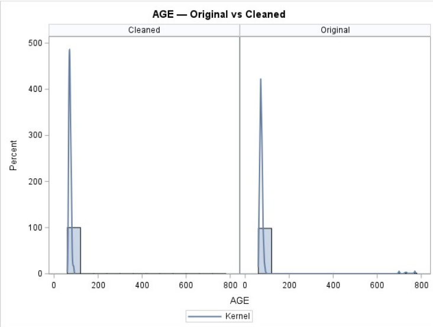

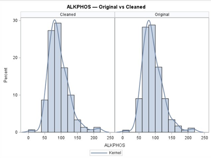

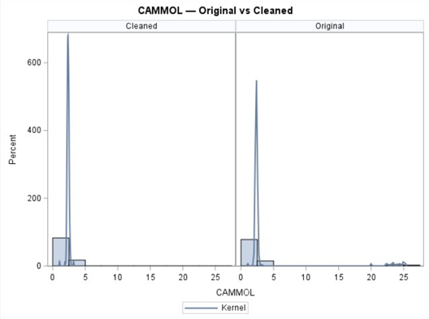

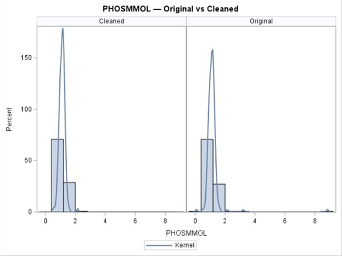  

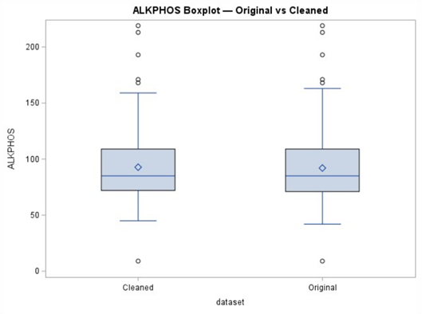

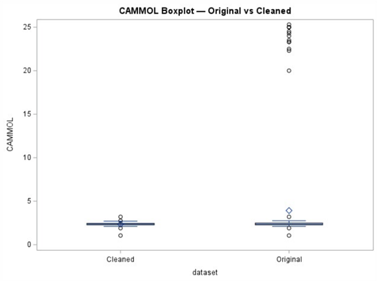

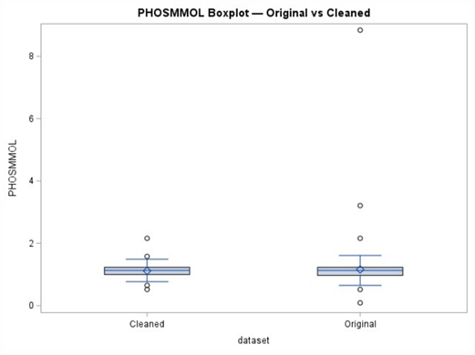

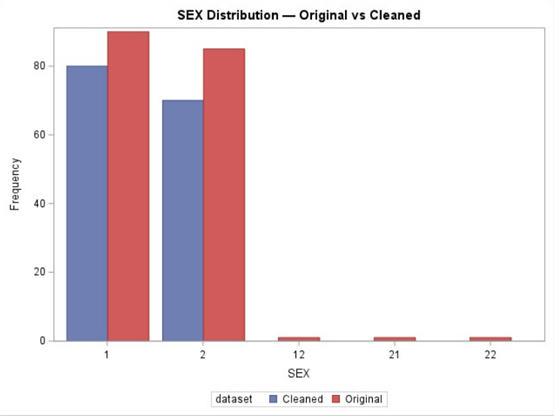

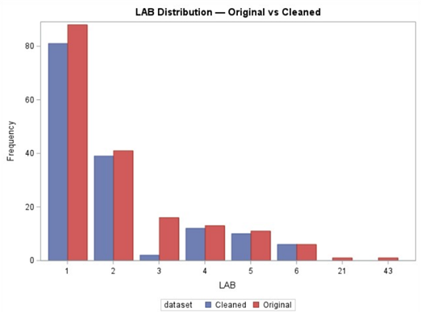

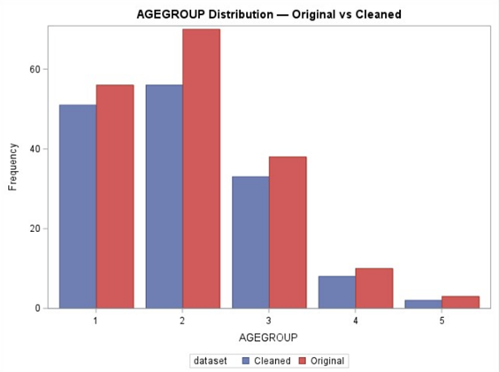

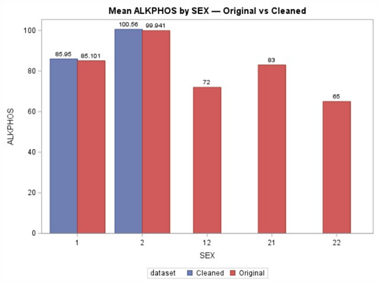

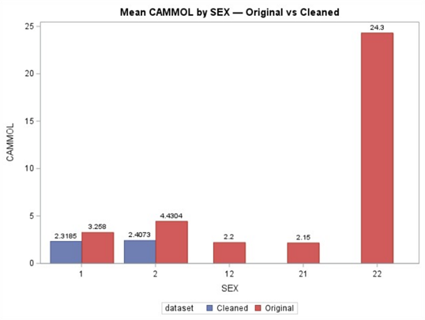

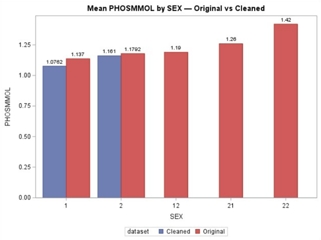

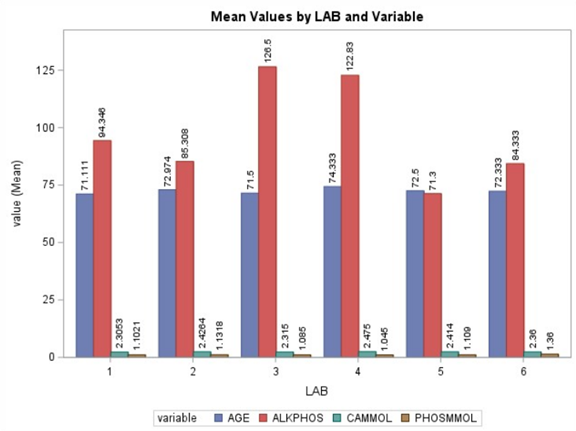

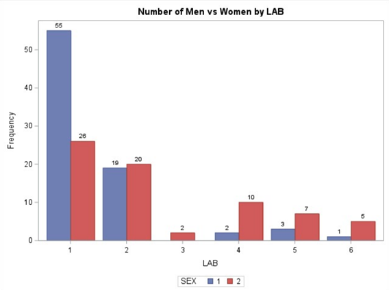

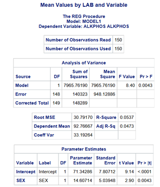

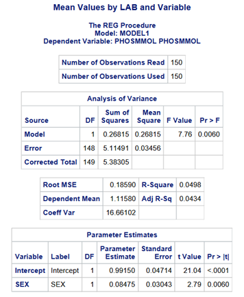

Of the 178 records, 175 (98%) had valid sex coding, while 3 (2%) had invalid sex coding. The mean age was 72 years, with four participants outside the valid range (\>120 years). ALKPHOS values were generally within the expected range, with one value being left blank. CAMMOL had a few more invalid values, with one being left blank and 13 values being \> 4.0 mmol/L. PHOSMMOL had one blank value and two values that were greater than 3.0 mmol/L. LAB codes were spread across six sites, with LAB 1, Metpath, accounting for \~50% of the sample. 

There was a slight SEX difference in ALKPHOS values, with the average mean value for men being 85.95 mmol/L, and the average mean value for women being 100.56 mmol/L. The average mean value for CAMMOL in men was 2.3185mmol/L, and the average mean value for women was 2.4073mmol/L. The average mean value of PHOSMMOL for men was 1.0762 mmol/L, and the average amount for women was 1.161 mmol/L. 

Across the 6 LABs, the values for AGE, CAMMOL, and PHOSMMOL were roughly the same, but ALKPHOS showed considerable variation. For LAB 1, ALKPHOS (mmol/L) was 94.346, LAB 2 was 85.308, LAB 3 was 126.5, LAB 5 was 122.83, and LAB 6 was 84.333. 

When a correlation test and regression model were run, they showed a significant probability that the variables affected SEX. From the regression model, ALKPHOS had a p-value of 0.0043, CAMMOL had a p-value of 0.0031, and PHOSMMOL had a p-value of 0.0060. 

The data had several missing or invalid values and had to be cleaned up. Both the original and clean values have been noted where necessary, while regression and correlation calculations were based on the cleaned data. 

The purpose of this analysis was to see if there were any gender differences in the levels of ALKPHOS, CAMMOL, or PHOSMMOL, as well as to evaluate whether the LAB used for these tests would affect the mean values of the study variables. The results of this analysis indicate a relationship between gender and the listed variables, and that the laboratory used for testing had an effect on the mean values of the variables. 

It is important to note that the data provided had missing and erroneously entered values, which had to be excluded from the final analysis. Had the calciumgood.dat file been available, the results may have been different, and caution should be exercised against making any conclusions based on this data alone. 

SAS Code to Identify Errors:

proc format;  
  value sex\_valid  1,2 \= 'Valid'  other \= 'Invalid';  
  value age\_valid  low-\<0 \= 'Invalid'  0-120 \= 'Valid'  120\<-high \= 'Invalid';  
  value alk\_valid  low-\<0 \= 'Invalid'  0-10000 \= 'Valid'  10000\<-high \= 'Invalid';  
  value cam\_valid  low-\<0 \= 'Invalid'  0.2-4.0 \= 'Valid'  4.0\<-high \= 'Invalid';  
  value phs\_valid  low-\<0 \= 'Invalid'  0.2-3.0 \= 'Valid'  3.0\<-high \= 'Invalid';  
run;

/\* SEX as Valid/Invalid \*/  
data calcium\_simple;  
  set calcium;  
  length SEX\_STATUS $8;  
  SEX\_STATUS \= put(sex, sex\_valid.);  /\* 'Valid' or 'Invalid' (missing \-\> Invalid via OTHER) \*/  
  label SEX\_STATUS \= 'SEX';  
run;

/\* SEX: Valid vs Invalid with Freq/Percent/Cum columns \*/  
title "SEX";  
proc freq data=calcium\_simple order=freq;  
  tables SEX\_STATUS / missing;  
run;

/\* LAB: raw distribution (includes '.' for missing)\*/  
title "LAB";  
proc freq data=calcium order=data;  
  tables lab / missing;  
run;

/\* AGEGROUP: raw distribution (includes '.' for missing)\*/  
title "AGEGROUP";  
proc freq data=calcium order=data;  
  tables agegroup / missing;  
run;

/\*Numeric sum\*/  
title "Numeric summaries: AGE, ALKPHOS, CAMMOL, PHOSMMOL";  
proc means data=calcium n nmiss mean std min p25 median p75 max;  
  var age alkphos cammol phosmmol;  
run;

/\*SQL: min/max/count of invalids \*/  
title "Invalid value min/max/count";  
proc sql;  
  /\* SEX invalid (= not 1/2 or missing) \*/  
  select min(sex) as min\_invalid\_sex,  
         max(sex) as max\_invalid\_sex,  
         count(\*) as n\_invalid\_sex  
  from calcium  
  where put(sex, sex\_valid.)='Invalid' or missing(sex);

  /\* AGE invalid \*/  
  select min(age) as min\_invalid\_age,  
         max(age) as max\_invalid\_age,  
         count(\*) as n\_invalid\_age  
  from calcium  
  where put(age, age\_valid.)='Invalid' or missing(age);

  /\* ALKPHOS invalid \*/  
  select min(alkphos) as min\_invalid\_alk,  
         max(alkphos) as max\_invalid\_alk,  
         count(\*) as n\_invalid\_alk  
  from calcium  
  where put(alkphos, alk\_valid.)='Invalid' or missing(alkphos);

  /\* CAMMOL invalid \*/  
  select min(cammol) as min\_invalid\_cam,  
         max(cammol) as max\_invalid\_cam,  
         count(\*) as n\_invalid\_cam  
  from calcium  
  where put(cammol, cam\_valid.)='Invalid' or missing(cammol);

  /\* PHOSMMOL invalid \*/  
  select min(phosmmol) as min\_invalid\_phos,  
         max(phosmmol) as max\_invalid\_phos,  
         count(\*) as n\_invalid\_phos  
  from calcium  
  where put(phosmmol, phs\_valid.)='Invalid' or missing(phosmmol);  
quit;

SAS code to create charts

/\* Validity rules\*/  
proc format;  
  value sex\_valid  1,2 \= 'Valid'  other \= 'Invalid';  
  value age\_valid  low-\<0 \= 'Invalid'  0-120 \= 'Valid'  120\<-high \= 'Invalid';  
  value alk\_valid  low-\<0 \= 'Invalid'  0-10000 \= 'Valid'  10000\<-high \= 'Invalid';  
  value cam\_valid  low-\<0 \= 'Invalid'  0.2-4.0 \= 'Valid'  4.0\<-high \= 'Invalid';  
  value phs\_valid  low-\<0 \= 'Invalid'  0.2-3.0 \= 'Valid'  3.0\<-high \= 'Invalid';  
  value lab\_valid  low-\<0 \= 'Invalid'  1.0-6.0 \= 'Valid'  7.0\<-high \= 'Invalid';  
run;

/\* Original\*/  
data calcium\_original;  
  set calcium;  
run;

/\*Cleaned copy\*/  
data calcium\_clean;  
  set calcium;  
  if put(sex,      sex\_valid.) \= 'Valid'  
 and put(age,      age\_valid.) \= 'Valid'  
 and put(alkphos,  alk\_valid.) \= 'Valid'  
 and put(cammol,   cam\_valid.) \= 'Valid'  
 and put(phosmmol, phs\_valid.) \= 'Valid'  
 and put(lab, lab\_valid.) \= 'Valid'  
and not missing(lab)  
 and not missing(agegroup);  
run;

/\*Side-by-side plotting\*/  
data calcium\_compare;  
  length dataset $8;  
  set calcium\_original(in=a) calcium\_clean(in=b);  
  if a then dataset='Original';  
  if b then dataset='Cleaned';  
run;

/\*Visuals: Original vs Cleaned\*/  
ods graphics on;

/\*Histograms \+ densities (AGE)\*/  
title "AGE — Original vs Cleaned";  
proc sgpanel data=calcium\_compare;  
  panelby dataset / columns=2 novarname;  
  histogram age;  
  density   age / type=kernel;  
run;

/\*Histograms \+ densities (labs)\*/  
title "ALKPHOS — Original vs Cleaned";  
proc sgpanel data=calcium\_compare;  
  panelby dataset / columns=2 novarname;  
  histogram alkphos;  
  density   alkphos / type=kernel;  
run;

title "CAMMOL — Original vs Cleaned";  
proc sgpanel data=calcium\_compare;  
  panelby dataset / columns=2 novarname;  
  histogram cammol;  
  density   cammol / type=kernel;  
run;

title "PHOSMMOL — Original vs Cleaned";  
proc sgpanel data=calcium\_compare;  
  panelby dataset / columns=2 novarname;  
  histogram phosmmol;  
  density   phosmmol / type=kernel;  
run;

/\*Boxplots (labs)\*/  
title "ALKPHOS Boxplot — Original vs Cleaned";  
proc sgplot data=calcium\_compare;  
  vbox alkphos / category=dataset;  
run;

title "CAMMOL Boxplot — Original vs Cleaned";  
proc sgplot data=calcium\_compare;  
  vbox cammol / category=dataset;  
run;  
title "PHOSMMOL Boxplot — Original vs Cleaned";  
proc sgplot data=calcium\_compare;  
  vbox phosmmol / category=dataset;  
run;  
/\*Clustered bars\*/  
title "SEX Distribution — Original vs Cleaned";  
proc sgplot data=calcium\_compare;  
  vbar sex / group=dataset groupdisplay=cluster;  
run;

/\* LAB and AGEGROUP\*/  
title "LAB Distribution — Original vs Cleaned";  
proc sgplot data=calcium\_compare;  
  vbar lab / group=dataset groupdisplay=cluster;  
run;

title "AGEGROUP Distribution — Original vs Cleaned";  
proc sgplot data=calcium\_compare;  
  vbar agegroup / group=dataset groupdisplay=cluster;  
run;  
title "Mean ALKPHOS by SEX — Original vs Cleaned";  
proc sgplot data=calcium\_compare;   
  vbar sex / response=alkphos stat=mean group=dataset groupdisplay=cluster datalabel;  
run;  
title "Mean CAMMOL by SEX — Original vs Cleaned";  
proc sgplot data=calcium\_compare;     
  vbar sex / response=cammol stat=mean group=dataset groupdisplay=cluster datalabel;  
run;  
title "Mean PHOSMMOL by SEX — Original vs Cleaned";  
proc sgplot data=calcium\_compare;   
  vbar sex / response=phosmmol stat=mean group=dataset groupdisplay=cluster datalabel;  
run;  
/\* Long format\*/  
data labs\_long;  
  set calcium\_clean;  
  length variable $12;  
  variable \= "AGE";        value \= age;        output;  
  variable \= "ALKPHOS";    value \= alkphos;    output;  
  variable \= "CAMMOL";     value \= cammol;     output;  
  variable \= "PHOSMMOL";   value \= phosmmol;   output;  
run;

title "Mean Values by LAB and Variable";  
proc sgplot data=labs\_long;  
  vbar lab / response=value stat=mean group=variable groupdisplay=cluster datalabel;  
run;  
/\*descriptive statistics\*/  
proc corr data=calcium\_clean;  
run;  
proc reg data=calcium\_clean;  
model alkphos \= sex;  
run;  
proc reg data=calcium\_clean;  
model cammol \= sex;  
run;  
proc reg data=calcium\_clean;  
model phosmmol \= sex;  
run;  
title "Calcium Clean Proc Means";  
proc means data=calcium\_clean mean min q1 median q3 max var std;  
run;

title "Calcium Proc Means";  
proc means data=calcium mean min q1 median q3 max var std;  
run;

